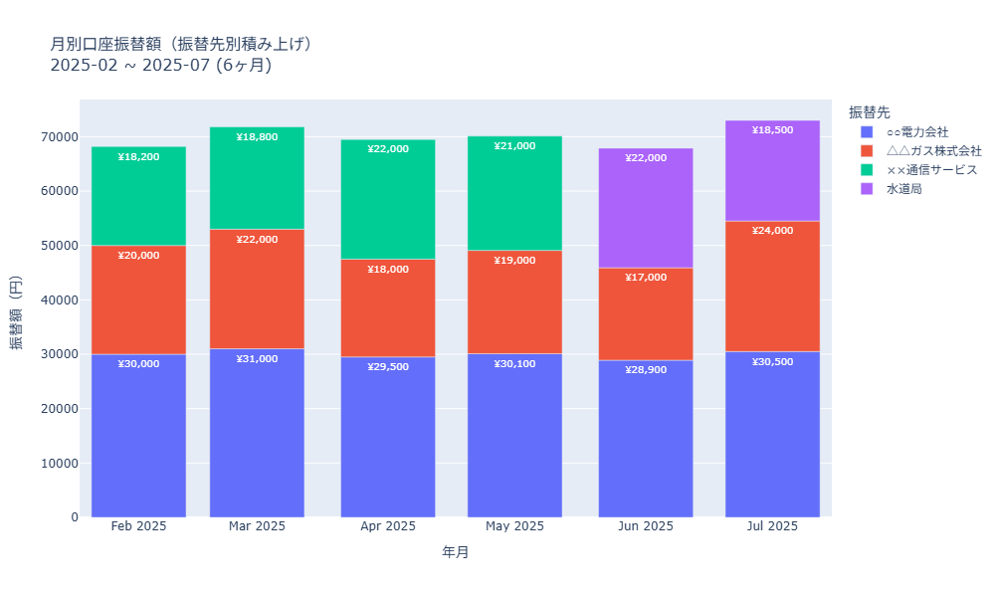
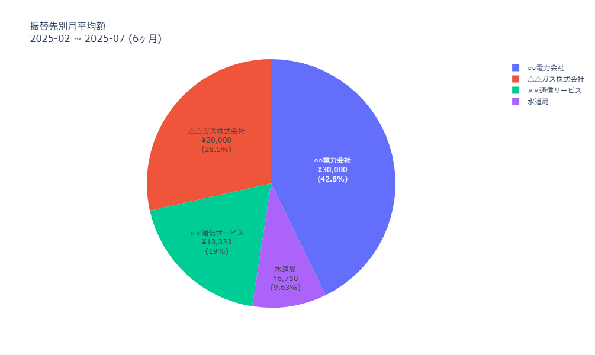
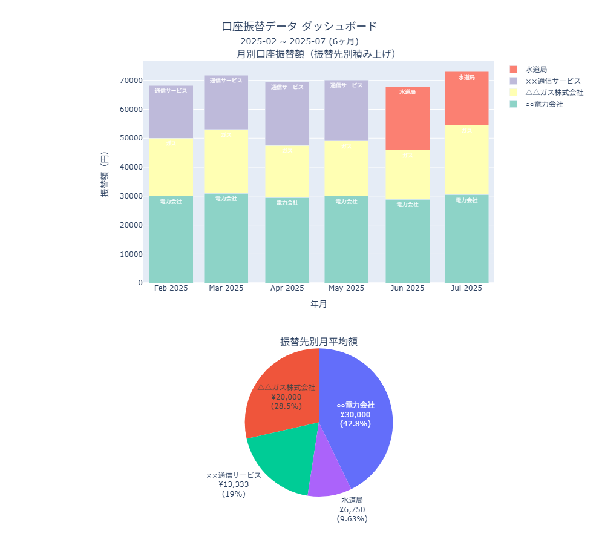

# Gmail口座振替通知集計ツール

Gmailに届く口座振替通知から今月の引き落とし金額を自動で集計するツールです。

## 機能

### 📧 メールデータ取得・解析
- Gmail APIを使用して、住信SBIネット銀行の口座振替通知メールを検索
- メール本文から以下を抽出
  - 口座振替先（口座名義）
  - 引き落とし金額
  - サンプル: sample_notification.eml
- 文字コード自動判定による日本語メールの確実な処理

### 💾 データ管理・キャッシュ
- 取得したデータは「結果ファイル」として保存し、APIの呼び出し回数を減らす
  - 年月・金額・振替先情報を `result_debit_YYYY-MM-DD.csv` 形式のCSVファイルに保存
  - 新しい結果ファイル作成時は古いファイルを自動削除
- 結果ファイルには作成日時が記録され、次回以降はその日時以降のメールのみ取得
- 金額が0円の無効なデータは自動除外

### 📊 データ分析・可視化
- 月別・振替先別のデータ集計
- インタラクティブなグラフ表示（Plotly使用）
  - 月別振替額の積み上げ棒グラフ
  - 振替先別月平均額の円グラフ
  - 統合ダッシュボード
- HTMLファイルでの出力保存

### グラフ表示例

分析機能を実行すると、以下のようなインタラクティブなグラフが生成されます：

#### 📊 月別積み上げ棒グラフ (`monthly_stacked_chart.html`)
- 各月の振替先別内訳を積み上げ形式で表示
- 月ごとの傾向と振替先の変化を視覚化



#### 🥧 振替先別円グラフ (`company_pie_chart.html`)  
- 各振替先の月平均金額と割合を円グラフで表示
- 主要な支出先を一目で把握



#### 📈 統合ダッシュボード (`dashboard.html`)
- 月別棒グラフと円グラフを1画面に統合表示
- データの全体像を効率的に確認



> **注意**: HTMLファイルはPlotlyを使用したインタラクティブなグラフです。ブラウザで開くとズーム・パン・ホバー表示などの操作が可能です。

### 🕐 期間指定機能
- 今月のみ取得（デフォルト）
- 過去1年分の一括取得
- 欠けている月のみ効率的に補完取得

## 制限

- **対応銀行**: 住信SBIネット銀行のみ
- **対象期間**: 2025年2月以降（1月以前は金額情報なかった）
- **メール形式**: 口座振替通知メールの特定フォーマットのみ

## 前提条件

### 動作確認環境
- **Python 3.13**
- **uv** (Python環境管理ツール)

### Gmail API設定
1. [Google Cloud Console](https://console.cloud.google.com/) でプロジェクトを作成
2. Gmail APIを有効化
3. OAuth 2.0認証情報を作成し、`credentials.json` としてプロジェクトルートに配置
4. 初回実行時にブラウザでOAuth認証を完了

## インストール・セットアップ

```bash
# リポジトリをクローン
git clone <repository-url>
cd gmail-debit-client

# 依存関係をインストール（uvが自動的に仮想環境を作成）
uv sync

# credentials.jsonを配置
# Google Cloud Consoleで取得した認証ファイルをプロジェクトルートに配置
```

## 使い方

### 基本的な使用方法

```bash
# 今月の口座振替情報を取得
uv run gmail_debit_collector.py

# 合計金額のみを表示（簡潔な出力）
uv run gmail_debit_collector.py --summary-only
uv run gmail_debit_collector.py -s

# 過去1年分の口座振替情報を取得
uv run gmail_debit_collector.py --year
uv run gmail_debit_collector.py -y
```

### データ分析・グラフ表示

```bash
# メール取得 + データ分析・グラフ表示
uv run gmail_debit_collector.py --analyze
uv run gmail_debit_collector.py -a

# 過去1年分の取得 + 分析
uv run gmail_debit_collector.py --year --analyze

# 分析のみ実行（メール取得なし）
uv run gmail_debit_collector.py --analyze-only

# 分析モジュール単体実行
uv run analyzer.py
```

### 実行例

```bash
# 基本実行
$ uv run gmail_debit_collector.py
INFO - 口座振替情報の取得を開始します
INFO - 既存の結果ファイルを確認: result_debit_2025-01-15.csv
INFO - 2件の既存データが見つかりました（金額0を除外後: 2件）
結果(result_debit_2025-01-15.csv)から取得:
2025-01 電力会社 ¥8,500
2025-01 ガス会社 ¥3,200
今月の口座振替合計：¥11,700

# 分析付き実行
$ uv run gmail_debit_collector.py --analyze
INFO - 口座振替情報の取得を開始します
==================================================
データ分析を開始します...
=== 口座振替データ サマリ ===
データソース: result_debit_2025-07-26.csv
期間: 2025-02 ~ 2025-07
総振替金額: ¥420,500
振替件数: 18件
対象月数: 6ヶ月
振替先数: 4社

=== 月別サマリ ===
2025-02: ¥68,200 (3件)
2025-03: ¥71,800 (3件) 
2025-04: ¥69,500 (3件)
2025-05: ¥70,100 (3件)
2025-06: ¥67,900 (3件)
2025-07: ¥73,000 (3件)

=== 振替先別サマリ ===
○○電力会社: ¥180,000 (6件)
△△ガス株式会社: ¥120,000 (6件)
××通信サービス: ¥72,000 (3件)
水道局: ¥48,500 (3件)
==================================================
グラフを生成しています...
グラフを保存しました: monthly_stacked_chart.html
グラフを保存しました: company_pie_chart.html
```

### ファイル構成

```
gmail-debit-client/
├── gmail_debit_collector.py   # メインスクリプト
├── analyzer.py                # データ分析・可視化
├── test_gmail_debit_collector.py # メインスクリプトのテスト
├── test_analyzer.py          # analyzerのテスト  
├── credentials.json          # Gmail API認証ファイル（要設定）
├── token.pickle              # 認証トークン（自動生成）
├── sample_notification.eml   # サンプルメールファイル
├── outputs/                  # 出力ファイル格納ディレクトリ
│   ├── result_debit_*.csv    # 取得結果ファイル（自動生成）
│   └── *.html                # グラフHTMLファイル（自動生成）
├── images/                   # README用画像ファイル
├── pyproject.toml           # プロジェクト設定・依存関係
├── uv.lock                  # 依存関係ロックファイル
├── .gitignore               # Git除外設定
├── CLAUDE.md                # 開発ガイド
└── README.md                # このファイル
```

### 出力ファイル

すべての出力ファイルは `outputs/` ディレクトリに保存されます：

| ファイル | 説明 | 形式 |
|---------|------|------|
| `outputs/result_debit_YYYY-MM-DD.csv` | 取得した口座振替データ | CSV |
| `outputs/monthly_stacked_chart.html` | 月別積み上げ棒グラフ | HTML |  
| `outputs/company_pie_chart.html` | 振替先別円グラフ | HTML |
| `outputs/dashboard.html` | 統合ダッシュボード | HTML |


## トラブルシューティング

### よくある問題

**Q: `credentials.json` が見つからないエラー**
```
FileNotFoundError: credentials.json
```
A: Google Cloud Consoleで取得したOAuth認証ファイルをプロジェクトルートに配置してください。

**Q: Gmail API認証エラー**
```
google.auth.exceptions.RefreshError
```  
A: `token.pickle` を削除して再認証してください。
```bash
rm token.pickle
uv run gmail_debit_collector.py
```

**Q: メールが見つからない**
```
0件のメールが見つかりました
```
A: 以下を確認してください：
- 住信SBIネット銀行からの口座振替通知メールが届いているか
- 検索対象期間にメールが存在するか（2025年1月以降）
- メールの件名に「口座振替」が含まれているか

**Q: 分析機能でエラー**
```
ImportError: No module named 'plotly'
```
A: 依存関係を再インストールしてください。
```bash
uv sync
```

### ログレベル設定

デバッグ情報が必要な場合は、gmail_debit_collector.pyの先頭でログレベルを変更：

```python
logging.basicConfig(
    level=logging.DEBUG,  # INFO から DEBUG に変更
    format="%(asctime)s - %(levelname)s - %(message)s"
)
```

## ライセンス

このプロジェクトは [MIT License](LICENSE) の下で公開されています。

```
MIT License - 自由に使用、修正、配布可能
Copyright (c) 2025 H.Saido
```
